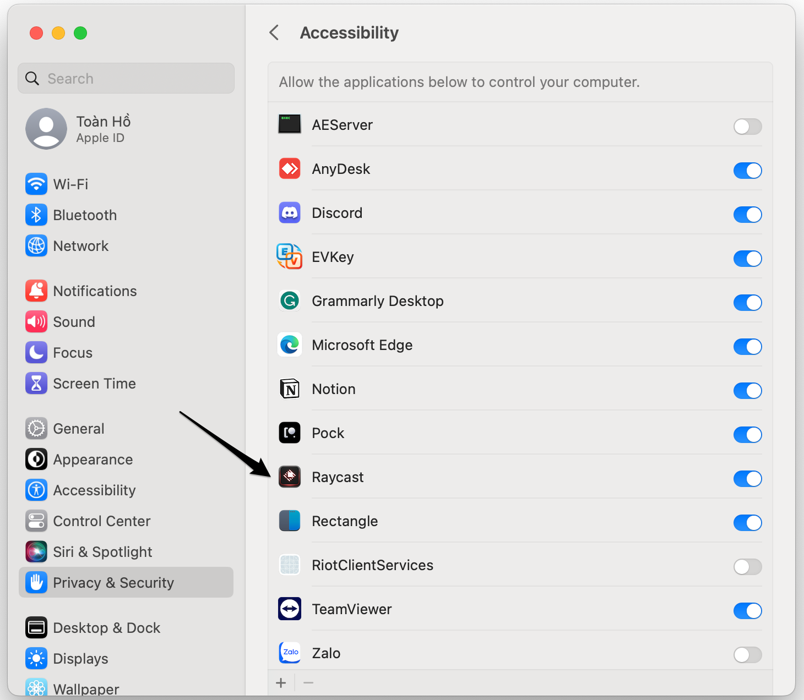
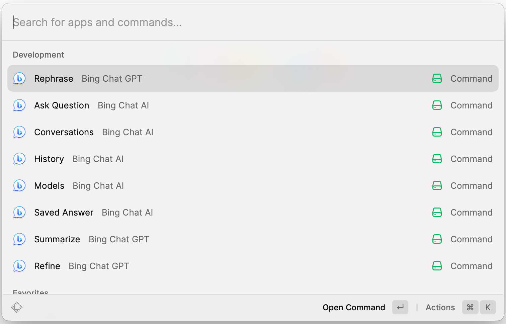

# Bing Chat GPT

    
    

### How to install

- Download the latest release from [this link](https://github.com/toanbku/bing-chat-raycast-extension/releases)
- Unzip the file and import the extension at ‘Import Extension’
  

### How to use

- Retrieve the whole cookie from bing.com and import it into this extension

  - Visit [https://bing.com](https://bing.com)
  - Open console tab
  - Run script
    - `document.cookie`
  - Then copy all of result to clipboard
    

- Make sure that you granted Raycast access to "Accessibility" in System Settings > Privacy & Security > Accessibility.
  

### Tips

To work faster, you can use hot keys for some commands. See the image below for how to do this. Open Raycast > Extension > Follow the steps in the image to change the hot key.

### Demo command

### Inspired by

- https://github.com/abielzulio/chatgpt-raycast

Made with ♥ from Vietnam

